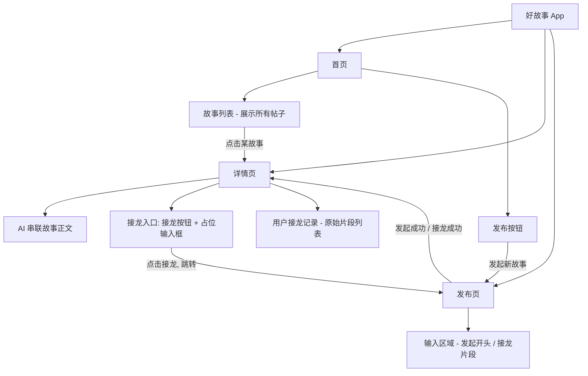
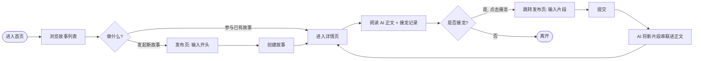
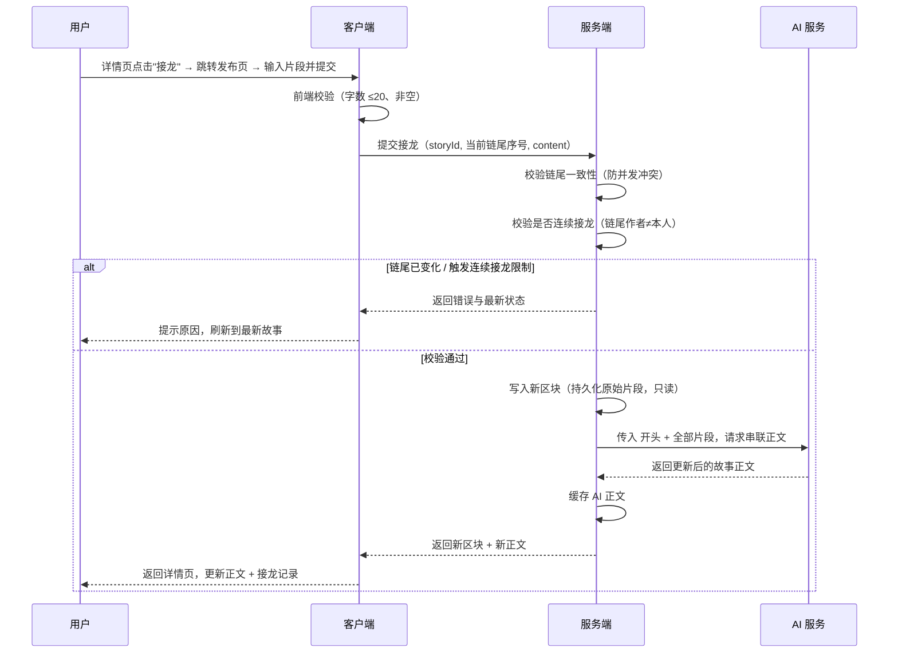
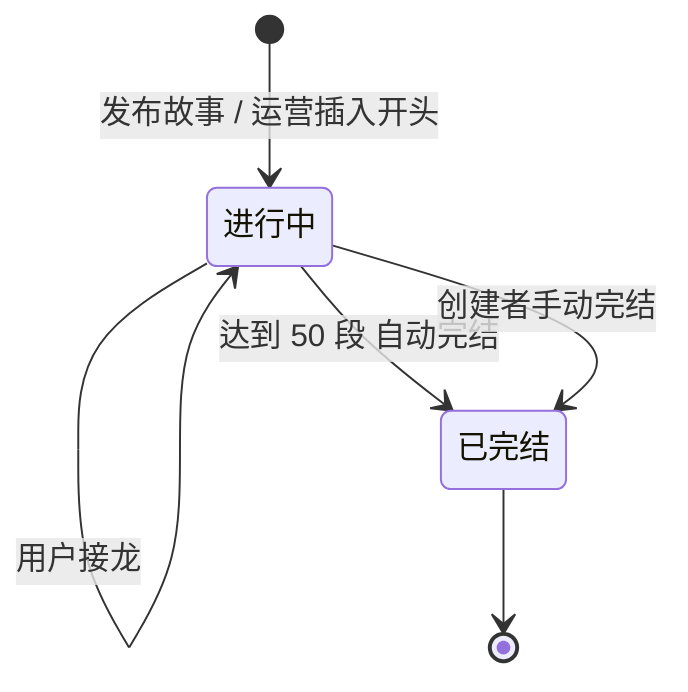
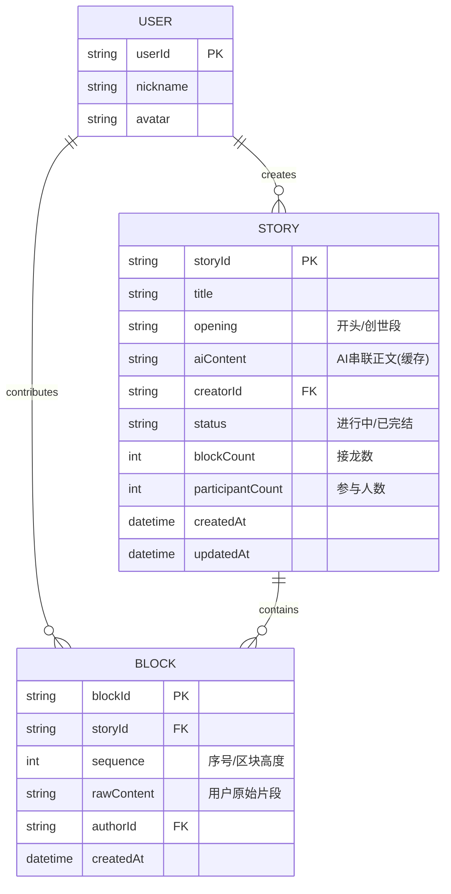

# 好故事（GoodStory）· 产品需求文档（PRD）

> 一句话定义：**一个由 AI 驱动的「区块链式」故事接龙社区**——系统或用户抛出一个故事开头，所有人按顺序接龙，每人只能写一小段，AI 负责把这些碎片串联、润色成一个连贯的完整故事。

---

## 1. 文档信息

| 项目 | 内容 |
| --- | --- |
| 产品名称 | 好故事（GoodStory） |
| 文档版本 | v1.0 |
| 文档状态 | 已确认，进入设计/技术方案 |
| 作者 | 产品 |
| 创建日期 | 2026-06-17 |
| 最近更新 | 2026-06-17 |

### 修订记录

| 版本 | 日期 | 修改人 | 说明 |
| --- | --- | --- | --- |
| v0.1 | 2026-06-17 | 产品 | 初稿，定义核心玩法与三个页面 |
| v1.0 | 2026-06-17 | 产品 | 确认 §15 全部决策：接龙跳转发布页、字数 20/50、不允许连续接龙、V1 不做风控/埋点/hash 校验、游客可浏览、完结机制等 |

---

## 2. 产品概述

### 2.1 背景与价值

传统的"故事接龙"游戏门槛低、互动性强，但有两个痛点：

1. **接龙内容割裂**——每个人的文风、节奏不同，拼起来读着很跳跃，不像一个完整的故事。
2. **缺乏沉淀与传播**——接龙过程散落在聊天记录里，难以回看、分享、形成作品。

**好故事**用 AI 解决"割裂"问题：用户只负责贡献**创意片段**（限制字数，降低门槛），AI 负责把所有片段**串联、过渡、润色**成一篇可读性高的连贯故事。同时借鉴**区块链**的思想——每一次接龙都是一个有序、不可篡改、可追溯贡献者的"区块"，让每个参与者的创作都被永久记录。

### 2.2 产品定位

- **轻量 UGC 内容社区** + **AI 协同创作工具**。
- 核心心智：**"我只写一句话，AI 帮我和一群人共同完成一部小说。"**

### 2.3 核心玩法（区块链式接龙）

| 区块链概念 | 在本产品中的映射 |
| --- | --- |
| 创世区块（Genesis Block） | 故事开头（用户发布，或运营手动插入） |
| 区块（Block） | 一次用户接龙（一段限定字数的原始输入） |
| 链（Chain） | 一个完整故事 = 开头 + 所有接龙区块按序连接 |
| 不可篡改 | 接龙一旦提交，不可编辑、不可删除 |
| 可追溯 | 每个区块永久记录贡献者与时间 |
| 顺序追加 | 新区块只能接在当前链尾，基于最新状态续写 |

> **关键设计**：用户看到的「故事正文」是 AI 串联润色后的版本；同时保留每个人接龙的「原始片段」可供回看。两者并存——AI 提升可读性，原始记录保证真实与归属。

---

## 3. 名词解释

| 名词 | 定义 |
| --- | --- |
| 故事（Story） | 一条接龙链，包含一个开头和若干接龙片段，对应一个"帖子" |
| 开头 / 创世段 | 故事的第一段，由发布者提供（或运营手动插入），是接龙的起点 |
| 接龙 / 片段（Block / Segment） | 用户单次提交的、限定字数的续写内容（原始输入） |
| AI 串联正文 | AI 基于「开头 + 全部片段」生成的连贯故事全文 |
| 接龙人 / 贡献者 | 提交过至少一个片段的用户 |
| 故事状态 | 进行中 / 已完结（详见 §8 状态机） |

---

## 4. 目标用户与使用场景

### 4.1 目标用户

| 用户类型 | 描述 | 核心诉求 |
| --- | --- | --- |
| 创作爱好者 | 喜欢写作、脑洞但没精力写长篇 | 低门槛地参与创作、看到自己的贡献成为作品的一部分 |
| 轻度互动用户 | 刷内容为主，偶尔参与 | 看有趣的故事、随手接一句、看 AI 怎么把大家的脑洞圆上 |
| 内容消费者 | 只看不写 | 读 AI 串联后的完整好故事 |

### 4.2 典型使用场景

- **场景 A（接龙）**：小明刷到一个故事开头"末日第七天，冰箱里只剩最后一罐可乐……"，点击接龙跳到发布页，写下"我把它让给了会说话的猫"，提交后 AI 把它自然地接进正文。
- **场景 B（发起）**：小红有个脑洞，在发布页写下故事开头并发布，期待网友帮她把故事写下去。
- **场景 C（围观）**：小李（甚至无需登录）进入一个热门故事详情页，从头读 AI 串联的完整故事，再翻看下面每个人的原始接龙，看哪句最离谱。

---

## 5. 产品目标与成功指标

### 5.1 产品目标（V1）

1. 跑通"发起 → 接龙 → AI 串联 → 阅读"的核心闭环。
2. 验证 AI 串联能否显著提升接龙故事的可读性与趣味性。
3. 验证用户是否愿意持续接龙（社区活跃度）。

### 5.2 成功指标

> 注：V1 **暂不建设精细化埋点**（见 §13）。下表中标「后台可得」的指标可直接从业务数据库统计；标「依赖埋点」的指标 V1 暂不采集，留作后续。

| 指标层级 | 指标 | V1 可得性 |
| --- | --- | --- |
| 北极星指标 | 日均有效接龙数 | 后台可得 |
| 内容供给 | 日均新发布故事数、活跃故事数 | 后台可得 |
| 参与度 | 人均接龙次数 | 后台可得 |
| 参与度 | 阅读人数 → 接龙人数转化率 | 依赖埋点（V1 不采集） |
| 内容质量 | 故事完结率 | 后台可得 |
| 内容质量 | 阅读完成率 | 依赖埋点（V1 不采集） |
| 留存 | 次日 / 7 日留存 | 依赖埋点（V1 不采集） |
| AI 质量 | AI 串联成功率 | 后台可得（服务端日志） |

---

## 6. 产品结构与功能架构

### 页面与功能清单

| 页面 | 模块 | 功能编号 |
| --- | --- | --- |
| 首页 | 故事列表 | F-100 |
| 首页 | 发布按钮 | F-110 |
| 详情页 | AI 串联故事正文 | F-200 |
| 详情页 | 接龙入口（按钮 + 占位输入框） | F-210 |
| 详情页 | 用户接龙记录 | F-220 |
| 发布页 | 输入区域（发起开头 / 接龙片段） | F-300 |

---

## 7. 核心业务流程

### 7.1 整体闭环

> 接龙与发起均在**发布页**完成输入提交。发布页通过进入来源区分两种模式（详见 F-300）。

### 7.2 接龙时序（含 AI 与并发）

---

## 8. 故事状态机

**完结条件（V1）**：
- 接龙达到 **50 段**自动完结；**或**
- **创建者手动完结**。

**已完结故事**：仅可阅读与分享，接龙入口隐藏/禁用。

---

## 9. 详细功能需求

### 9.1 首页

首页由两部分组成：**故事列表** + **发布按钮**。

#### F-100 故事列表

**功能描述**：以信息流形式展示所有用户发布的故事（帖子）。

**列表项（卡片）展示字段**：

| 字段 | 说明 | 必选 |
| --- | --- | --- |
| 故事标题 | 取开头首句/截取作为标题 | 是 |
| 故事摘要 | AI 串联正文的前 N 字 | 是 |
| 接龙数 | 当前故事的片段数量 | 是 |
| 参与人数 | 去重贡献者数 | 是 |
| 状态标签 | 进行中 / 已完结 | 是 |
| 更新时间 | 最近一次接龙时间 | 是 |
| 发起人 | 昵称 + 头像 | 否 |

**交互与规则**：

| 编号 | 需求 |
| --- | --- |
| F-100-1 | 列表支持下拉刷新、上拉加载更多（分页） |
| F-100-2 | 点击任意卡片进入对应**详情页** |
| F-100-3 | **排序仅按「最新更新」**（最近被接龙/创建的排前），V1 不做其他排序与筛选 |
| F-100-4 | 空状态：无任何故事时展示引导文案 + 突出发布按钮 |
| F-100-5 | 加载中骨架屏；加载失败可重试 |
| F-100-6 | 「进行中」状态卡片应有可识别的视觉标识，引导用户去接龙 |
| F-100-7 | 游客（未登录）可正常浏览列表 |

#### F-110 发布按钮

**功能描述**：首页常驻的发布入口，点击进入发布页发起新故事。

| 编号 | 需求 |
| --- | --- |
| F-110-1 | 发布按钮全局可见（建议悬浮 FAB 或底部固定），不被列表滚动遮挡 |
| F-110-2 | 点击跳转**发布页**（F-300），进入"发起新故事"模式 |
| F-110-3 | 未登录用户点击时触发登录流程（浏览不需登录，发布需登录） |

---

### 9.2 详情页

详情页由三部分组成：**① AI 串联故事正文** + **② 接龙入口（接龙按钮 + 占位输入框）** + **③ 用户接龙记录**。

> 说明：详情页底部的"输入框"为**占位入口**（看起来像输入框，引导用户接龙），点击后**跳转到发布页**进行真正的输入与提交；详情页本身不内联提交。

#### F-200 AI 串联故事正文

**功能描述**：展示 AI 基于「开头 + 所有接龙片段」生成的连贯故事全文。这是用户阅读故事的主体。

| 编号 | 需求 |
| --- | --- |
| F-200-1 | 展示 AI 串联后的完整正文，排版可读（段落、换行） |
| F-200-2 | 展示故事元信息：标题、状态、接龙数、参与人数 |
| F-200-3 | 正文随每次成功接龙实时/准实时更新 |
| F-200-4 | AI 正文不可被用户编辑（只读） |
| F-200-5 | 正文需可区分"AI 加工"属性（如标注"本故事由 AI 串联生成"），保证内容来源透明 |
| F-200-6 | 正文过长时支持展开/收起或滚动阅读 |
| F-200-7 | 异常兜底：AI 正文生成失败时，降级展示「开头 + 原始片段顺序拼接」，并提示稍后重试 |
| F-200-8 | 游客可正常阅读正文 |

#### F-210 接龙入口（接龙按钮 + 占位输入框）

**功能描述**：详情页提供接龙入口，点击跳转发布页完成接龙。

| 编号 | 需求 |
| --- | --- |
| F-210-1 | 提供接龙入口：一个占位输入框样式 + 接龙按钮（如"接下去会发生什么？"占位文案） |
| F-210-2 | 点击入口**跳转发布页**（F-300），进入"接龙"模式，并带上当前 storyId 与链尾序号 |
| F-210-3 | 未登录用户点击时触发登录流程 |
| F-210-4 | 「已完结」故事隐藏或禁用接龙入口，提示"故事已完结" |
| F-210-5 | **不允许连续接龙**：若当前链尾片段的作者为当前用户，入口置灰/点击后提示"请等待其他人接龙后再继续" |

> 字数限制、提交、内容校验等均在发布页执行（见 F-300）。

#### F-220 用户接龙记录

**功能描述**：按顺序展示每个用户提交的**原始片段**（未经 AI 加工），体现"区块链式"的可追溯与归属。

| 字段 | 说明 |
| --- | --- |
| 序号 | 第几段接龙（区块高度） |
| 原始内容 | 用户提交的原文 |
| 贡献者 | 昵称 + 头像 |
| 时间 | 提交时间 |

| 编号 | 需求 |
| --- | --- |
| F-220-1 | 按接龙顺序（正序，从开头到最新）展示所有原始片段 |
| F-220-2 | 第一条为"开头/创世段"，需有明显标识（发布者或运营插入） |
| F-220-3 | 每条片段展示贡献者信息，体现归属 |
| F-220-4 | 原始记录不可编辑、不可删除（不可篡改） |
| F-220-5 | 记录较多时分页或滚动加载 |
| F-220-6 | 游客可正常查看记录 |

---

### 9.3 发布页

#### F-300 输入区域（发起开头 / 接龙片段）

**功能描述**：一个输入区域，根据进入来源承载两种模式：
- **发起模式**（从首页发布按钮进入）：输入故事**开头**；
- **接龙模式**（从详情页接龙入口进入）：输入续写**片段**。

| 编号 | 需求 |
| --- | --- |
| F-300-1 | 提供文本输入区域，聚焦后自动唤起键盘 |
| F-300-2 | **字数限制**：发起开头 **≤ 50 字**；接龙片段 **≤ 20 字**；实时显示已输入/上限字数 |
| F-300-3 | 超过字数上限时禁止继续输入或禁用提交按钮 |
| F-300-4 | 内容为空/纯空白时，提交按钮不可用 |
| F-300-5 | 提供"发布/提交"按钮，提交中 loading 防重复提交 |
| F-300-6 | **发起模式**提交成功后：创建故事，跳转到该故事**详情页** |
| F-300-7 | **接龙模式**提交成功后：返回对应故事**详情页**并刷新（正文 + 记录） |
| F-300-8 | 接龙模式需校验：链尾一致性（并发）、非连续接龙、故事未完结；不满足时提示并返回最新状态 |
| F-300-9 | 输入区根据模式展示不同占位引导文案（发起："写下你的故事开头……" / 接龙："接下去会发生什么？"） |
| F-300-10 | 离开页面时若有未提交内容，给出二次确认，避免误丢失 |
| F-300-11 | 进入发布页需登录态；未登录则先登录 |

> V1 **不做内容安全/敏感词校验**（见 §10、§15-Q4）。

---

## 10. AI 能力需求

### 10.1 故事串联（核心，P0）

| 项 | 说明 |
| --- | --- |
| 输入 | 故事开头 + 按序排列的全部用户原始片段 |
| 输出 | 一篇连贯、通顺、有过渡的完整故事正文 |
| 核心要求 | ① 忠实保留每个片段的核心情节，不丢关键信息；② 平滑过渡、统一文风；③ 不擅自改变故事走向或新增重大情节；④ 输出长度随片段增长而合理增长 |
| 触发时机 | 每次成功接龙后重新生成（或增量续写，见性能优化） |
| 兜底 | 生成失败时降级为原始片段顺序拼接 |

**性能与成本优化方向（技术侧）**：
- 增量生成：仅对新片段做衔接，而非每次全量重写，降低延迟与成本。
- 结果缓存：正文生成后缓存，阅读时直接读缓存。
- 异步生成：接龙先落库返回成功，正文异步更新。

### 10.2 内容安全审核（V1 不做）

> 按决策 Q4，**V1 暂不做内容风控/敏感词审核**。仅保留前端基础校验（字数、非空）。内容安全能力列入后续迭代（§16），上线前需评估合规风险。

### 10.3 辅助能力（后续）

- AI 自动为故事起标题（V1 用开头截取，AI 起标题列 V2）。
- AI 生成故事开头（V1 不做，运营如需可手动插入，见 Q10）。
- AI 生成故事封面图（V2+）。

---

## 11. 数据模型（概念模型）

> 区块链类比落地：`BLOCK.sequence` 即区块高度；新区块必须基于当前最大 `sequence` 追加（**链尾一致性校验**实现"顺序追加"）；`BLOCK` 一经写入只读不可改，实现"不可篡改 + 可追溯"。
>
> 按决策 Q8，**V1 不引入 hash 链（prevHash）做强校验**，仅以 `sequence` 顺序 + 只读约束保证有序与不可篡改即可。

---

## 12. 异常与边界处理

| 场景 | 处理 |
| --- | --- |
| 网络异常 | 提交失败提示重试；列表/详情加载失败可重试 |
| AI 正文生成失败 | 降级为原始片段拼接 + "正文生成中/稍后重试"提示 |
| 接龙并发冲突 | 校验链尾，冲突则提示并刷新到最新状态后再续写 |
| 连续接龙 | 链尾作者为本人时拦截，提示等待他人接龙 |
| 重复提交 | 提交按钮 loading 锁 + 服务端幂等 |
| 字数超限/为空 | 前端拦截 + 服务端二次校验 |
| 故事已完结后接龙 | 隐藏/禁用接龙入口并提示 |
| 未登录操作 | 浏览放行；接龙/发布触发登录流程 |
| 故事被删除/下架 | 详情页给出失效提示，引导返回首页 |

---

## 13. 非功能性需求

| 类别 | 要求 |
| --- | --- |
| 性能 | 首页列表首屏加载 < 2s；接龙提交响应 < 1s（AI 正文可异步）；AI 正文生成 P95 < 5s |
| 可用性 | 核心链路（看/发/接）可用性 ≥ 99.9% |
| 成本 | AI 调用需做增量与缓存优化，控制单次接龙成本 |
| 内容透明 | 明确标注 AI 生成/加工内容 |
| 内容安全 | **V1 不做风控**（见 Q4）；上线前需法务/合规确认风险，后续补齐机审 |
| 数据埋点 | **V1 不建设埋点**（见 Q9）；指标依赖后台数据库统计（见 §5.2） |
| 兼容性 | 适配主流机型与系统版本（具体清单待技术评审） |

---

## 14. 需求优先级（V1 范围）

| 优先级 | 功能 |
| --- | --- |
| P0（必做） | 首页列表 F-100、发布按钮 F-110、详情页正文 F-200、接龙入口 F-210、接龙记录 F-220、发布输入 F-300、AI 串联 §10.1、并发与连续接龙校验、完结机制 |
| P1（重要） | AI 自动起标题、分享 |
| P2（增强） | 点赞/最佳脑洞、AI 帮开头、AI 封面、内容风控、埋点体系、hash 链增强、排序/筛选 |

---

## 15. 产品决策记录（v1.0 已确认）

| 编号 | 决策点 | 最终结论 |
| --- | --- | --- |
| Q1 | 首页排序 | **仅「最新更新」**，不做其他排序/筛选 |
| Q2 | 字数上限 | **接龙 ≤ 20 字；开头 ≤ 50 字** |
| Q3 | 连续接龙 | **不允许连续接龙**（链尾作者为本人时不可再接） |
| Q4 | 内容风控 | **V1 暂不做**（仅前端字数/非空校验） |
| Q5 | 完结机制 | **达 50 段自动完结 + 创建者可手动完结** |
| Q6 | 登录策略 | **游客可浏览**；接龙/发布需登录 |
| Q7 | 接龙方式 | **点击接龙跳转发布页**输入提交（详情页输入框为占位入口） |
| Q8 | hash 链校验 | **V1 不做**，仅 sequence 顺序 + 只读保证不可篡改 |
| Q9 | 埋点 | **V1 不做**，指标走后台数据库统计 |
| Q10 | 系统生成开头 | **运营手动插入**，产品侧暂不做功能 |

---

## 16. 后续迭代规划（Roadmap 草案）

- **V1（MVP）**：跑通发布 → 接龙 → AI 串联 → 阅读闭环（游客可浏览、登录后接龙/发布）。
- **V2（互动 + 治理）**：内容风控/机审、埋点体系、分享、AI 起标题、最热排序、点赞/最佳脑洞。
- **V3（生态/激励）**：AI 帮开头、AI 封面、贡献者主页与成就、话题/分类、创作激励、hash 链增强。

---

> 备注：本文档为 v1.0，§15 决策已确认。下一步可据此输出交互稿（页面流转 + 关键状态）与技术方案（数据库设计、AI 串联服务、并发控制）。
